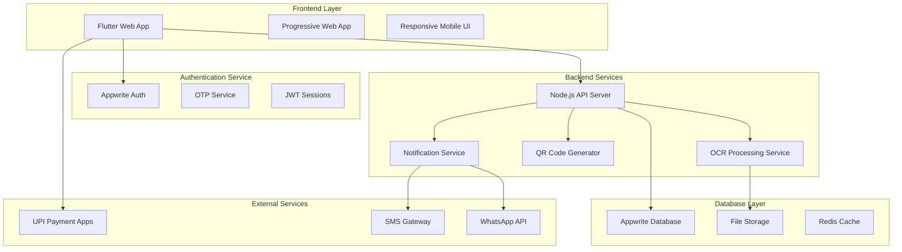
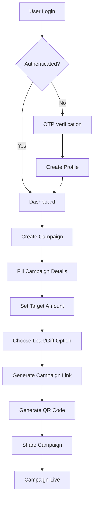
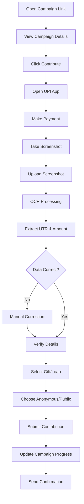
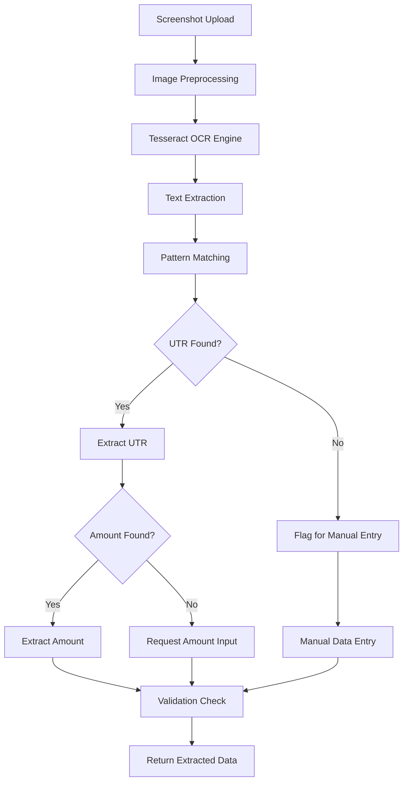
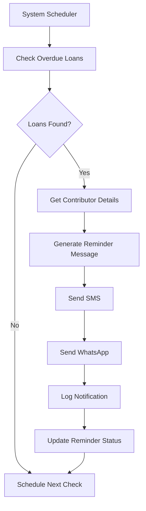
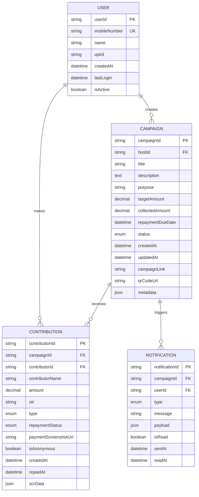
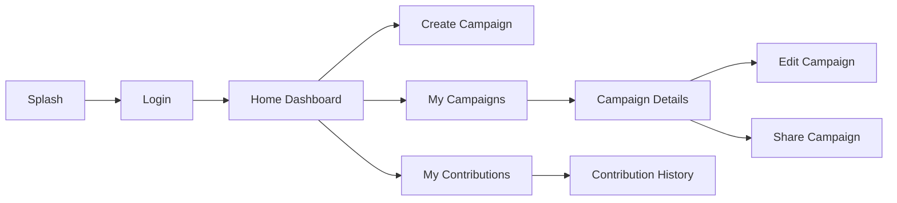
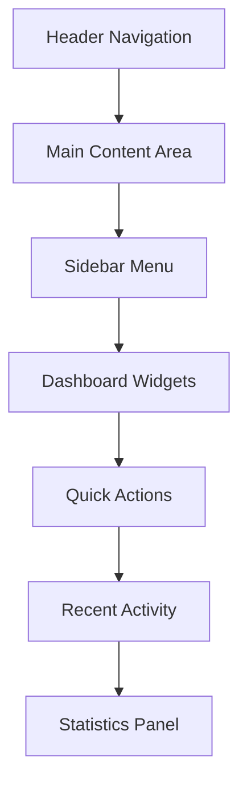
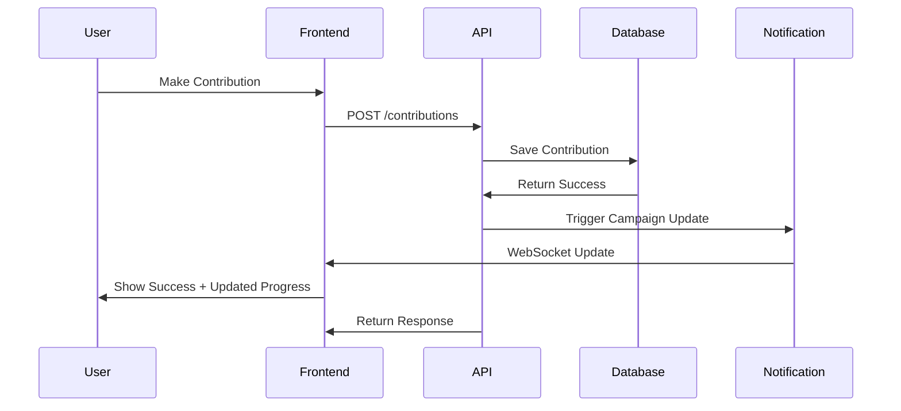
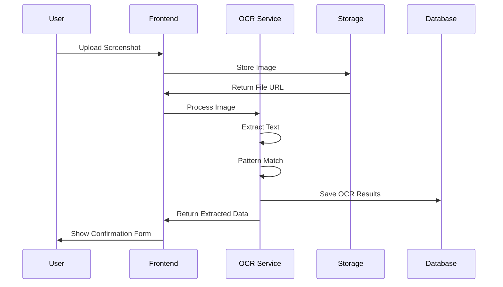

# FriendFund 🤝💰

**Project:** FriendFund  
**Author:** Ayra Riyaz  
**Company:** Pro26  
**Website:** https://pro26.in  
**GitHub:** https://github.com/ayrariyaz

A comprehensive crowdfunding platform that allows friends to create campaigns and collect money through UPI payments, with intelligent OCR for automatic payment verification.

## 📋 Table of Contents

- [🎯 Project Overview](#-project-overview)
- [🏗️ System Architecture](#️-system-architecture)
- [🔄 Workflow Diagrams](#-workflow-diagrams)
- [📊 Database Schema](#-database-schema)
- [🚀 Features](#-features)
- [🛠️ Technology Stack](#️-technology-stack)
- [📱 User Interface](#-user-interface)
- [🔐 Security Implementation](#-security-implementation)
- [🌐 API Documentation](#-api-documentation)
- [📈 Performance Metrics](#-performance-metrics)
- [🎨 Design Patterns](#-design-patterns)
- [🔄 Data Flow](#-data-flow)
- [📱 Mobile Experience](#-mobile-experience)
- [🚀 Deployment Strategy](#-deployment-strategy)
- [👨‍💻 Development Team](#-development-team)

## 🎯 Project Overview

FriendFund is a modern crowdfunding platform designed specifically for peer-to-peer fundraising among friends and family. It combines the convenience of UPI payments with intelligent OCR technology to create a seamless donation experience.

### Problem Statement

Traditional fundraising platforms are either too complex for casual use among friends or charge high fees. FriendFund solves this by providing a simple, transparent, and fee-free platform for personal fundraising campaigns.

### Solution Approach

- **Simplicity First**: Easy campaign creation and contribution process
- **Trust & Transparency**: Public contribution tracking and real-time updates
- **Technology Integration**: OCR for automatic payment verification
- **Mobile-First**: Optimized for smartphone usage

### Target Audience

- Students raising funds for projects or emergencies
- Families collecting money for events or medical expenses
- Friend groups organizing trips or gifts
- Small communities supporting local causes

## 🏗️ System Architecture



### Architecture Components

#### 1. **Frontend (Flutter Web)**

- **Framework**: Flutter 3.16+ with web support
- **State Management**: GetX for reactive programming
- **UI Components**: Custom responsive widgets
- **PWA Features**: Offline support, installable app
- **Build Output**: Single Page Application (SPA)

#### 2. **Backend (Node.js + Appwrite)**

- **Runtime**: Node.js 18+ serverless functions
- **Database**: Appwrite NoSQL collections
- **File Storage**: Appwrite storage for screenshots
- **Authentication**: Direct Appwrite integration
- **API Design**: RESTful endpoints with JSON responses

#### 3. **OCR Processing Pipeline**

- **Engine**: Tesseract.js for web-based OCR
- **Input**: Payment screenshot images
- **Output**: Extracted UTR and amount data
- **Validation**: Pattern matching and verification
- **Fallback**: Manual correction interface

#### 4. **Notification System**

- **SMS**: Bulk SMS for loan reminders
- **WhatsApp**: Business API for rich notifications
- **In-App**: Real-time push notifications
- **Email**: Campaign updates and receipts

## 🔄 Workflow Diagrams

### Campaign Creation Flow



### Contribution Flow



### OCR Processing Workflow



### Notification System Flow



## 📊 Database Schema

### Entity Relationship Diagram



### Data Types & Constraints

#### Users Collection

```json
{
  "userId": "string (UUID, Primary Key)",
  "mobileNumber": "string (10 digits, Unique, Index)",
  "name": "string (1-100 chars, Optional)",
  "upiId": "string (UPI format, Optional)",
  "createdAt": "datetime (Auto-generated)",
  "lastLogin": "datetime (Auto-updated)",
  "isActive": "boolean (Default: true)"
}
```

#### Campaigns Collection

```json
{
  "campaignId": "string (UUID, Primary Key)",
  "hostId": "string (Foreign Key to users.userId)",
  "title": "string (5-100 chars, Required)",
  "description": "text (10-1000 chars, Required)",
  "purpose": "string (5-200 chars, Required)",
  "targetAmount": "decimal (Min: 100, Max: 1000000)",
  "collectedAmount": "decimal (Default: 0, Calculated)",
  "repaymentDueDate": "datetime (Optional, Future date)",
  "status": "enum ['active', 'closed', 'paused']",
  "createdAt": "datetime (Auto-generated)",
  "updatedAt": "datetime (Auto-updated)",
  "campaignLink": "string (Generated URL)",
  "qrCodeUrl": "string (QR image URL)",
  "metadata": "json (Additional campaign data)"
}
```

#### Contributions Collection

```json
{
  "contributionId": "string (UUID, Primary Key)",
  "campaignId": "string (Foreign Key to campaigns.campaignId)",
  "contributorId": "string (Foreign Key to users.userId, Optional)",
  "contributorName": "string (Or 'Anonymous')",
  "amount": "decimal (Min: 1, Max: targetAmount)",
  "utr": "string (12 digits, Unique per campaign)",
  "type": "enum ['gift', 'loan']",
  "repaymentStatus": "enum ['pending', 'repaid', 'overdue']",
  "paymentScreenshotUrl": "string (Appwrite file URL)",
  "isAnonymous": "boolean (Default: false)",
  "createdAt": "datetime (Auto-generated)",
  "repaidAt": "datetime (Set when loan repaid)",
  "ocrData": "json (OCR extraction results)"
}
```

## 🚀 Features

### 1. **Authentication System**

- **OTP-based Login**: Mobile number verification via SMS
- **Session Management**: JWT tokens with automatic refresh
- **Profile Management**: User details and UPI ID storage
- **Security**: Rate limiting, session expiry, device tracking

### 2. **Campaign Management**

- **Easy Creation**: Intuitive form with validation
- **Rich Media**: Support for images and descriptions
- **Goal Tracking**: Real-time progress visualization
- **Flexible Timing**: Optional deadlines and reminders
- **Social Sharing**: Generated links and QR codes

### 3. **Smart Contribution System**

- **UPI Integration**: Direct deep links to payment apps
- **OCR Verification**: Automatic screenshot processing
- **Dual Purpose**: Gift or loan classification
- **Privacy Options**: Anonymous contribution support
- **Real-time Updates**: Live progress tracking

### 4. **Advanced OCR Processing**

- **Multi-format Support**: Various UPI app screenshots
- **Pattern Recognition**: UTR and amount extraction
- **Error Handling**: Fallback to manual entry
- **Validation**: Cross-verification with payment data
- **Learning Algorithm**: Improves accuracy over time

### 5. **Notification & Reminder System**

- **Automated Alerts**: Overdue loan detection
- **Multi-channel**: SMS, WhatsApp, in-app notifications
- **Customizable**: Host-controlled reminder frequency
- **Smart Timing**: Optimal delivery scheduling
- **Tracking**: Delivery confirmation and response rates

### 6. **Analytics & Reporting**

- **Campaign Insights**: Contribution patterns and timing
- **User Behavior**: Engagement and retention metrics
- **Financial Tracking**: Money flow and repayment rates
- **Performance**: System health and response times
- **Export Options**: Data download for accounting

## 🛠️ Technology Stack

### Frontend Technologies

```yaml
Framework: Flutter 3.16+
Language: Dart 3.0+
State Management: GetX 4.6+
UI Components:
  - Material Design 3
  - Custom responsive widgets
  - Cupertino iOS components
Networking:
  - Dio HTTP client
  - Real-time WebSocket connections
Development Tools:
  - Flutter DevTools
  - VS Code extensions
  - Chrome DevTools
Build System:
  - Flutter Web renderer
  - Service Worker for PWA
  - Tree shaking optimization
```

### Backend Technologies

```yaml
Runtime: Node.js 18+ (Serverless)
Database: Appwrite NoSQL
Authentication: Appwrite Auth Service
File Storage: Appwrite Storage
Functions:
  - Campaign CRUD operations
  - OCR processing pipeline
  - Notification delivery system
  - QR code generation
External APIs:
  - SMS gateway integration
  - WhatsApp Business API
  - UPI payment verification
```

### Development & DevOps

```yaml
Version Control: Git with GitHub
CI/CD: GitHub Actions
Code Quality:
  - ESLint for JavaScript
  - Dart analyzer for Flutter
  - Prettier for formatting
Testing:
  - Unit tests with Jest
  - Widget tests with Flutter
  - Integration testing
Monitoring:
  - Appwrite analytics
  - Error tracking
  - Performance monitoring
Deployment:
  - Vercel for frontend
  - Appwrite Cloud for backend
  - CDN for static assets
```

## 📱 User Interface

### Design System

#### Color Palette

```css
Primary: #2563EB (Violet 600)
Secondary: #059669 (Emerald 600)
Success: #10B981 (Emerald 500)
Warning: #F59E0B (Amber 500)
Error: #EF4444 (Red 500)
Background: #F9FAFB (Gray 50)
Surface: #FFFFFF (White)
Text Primary: #111827 (Gray 900)
Text Secondary: #6B7280 (Gray 500)
```

#### Typography

```css
Headings: Google Fonts Roboto
Body Text: System fonts with fallbacks
Font Sizes: 12px, 14px, 16px, 18px, 24px, 32px
Font Weights: 400 (Regular), 500 (Medium), 600 (Semibold)
Line Heights: 1.2 (Headings), 1.5 (Body)
```

#### Layout System

```css
Breakpoints:
  - Mobile: 0-450px
  - Tablet: 451-800px
  - Desktop: 801-1920px
  - Large: 1921px+
Spacing: 4px base unit (4, 8, 12, 16, 24, 32, 48, 64px)
Border Radius: 8px (Standard), 12px (Cards), 24px (Buttons)
Shadows: Subtle depth with multiple layers
```

### Screen Flows

#### Mobile Interface



#### Desktop Interface



## 🔐 Security Implementation

### Authentication Security

- **OTP Verification**: SMS-based two-factor authentication
- **Session Management**: JWT with refresh token rotation
- **Rate Limiting**: Login attempt restrictions
- **Device Tracking**: Suspicious activity detection

### Data Protection

- **Encryption**: AES-256 for sensitive data
- **HTTPS**: TLS 1.3 for all communications
- **Input Validation**: Server-side sanitization
- **SQL Injection**: Parameterized queries and ORM protection

### File Security

- **Upload Restrictions**: File type and size validation
- **Virus Scanning**: Automatic malware detection
- **Access Control**: Signed URLs for file access
- **Backup**: Encrypted cloud storage

### Privacy Compliance

- **Data Minimization**: Collect only necessary information
- **User Control**: Account deletion and data export
- **Anonymization**: Remove PII from analytics
- **Consent Management**: Clear privacy policy acceptance

## 🌐 API Documentation

### Authentication Endpoints

```http
POST /api/auth/send-otp
Content-Type: application/json

{
  "mobileNumber": "+919876543210"
}

Response: {
  "success": true,
  "message": "OTP sent successfully",
  "expiresIn": 300
}
```

```http
POST /api/auth/verify-otp
Content-Type: application/json

{
  "mobileNumber": "+919876543210",
  "otp": "123456"
}

Response: {
  "success": true,
  "token": "eyJhbGciOiJIUzI1NiIsInR5cCI6IkpXVCJ9...",
  "user": {
    "userId": "user123",
    "name": "John Doe",
    "mobileNumber": "+919876543210"
  }
}
```

### Campaign Endpoints

```http
GET /api/campaigns
Authorization: Bearer {token}

Response: {
  "success": true,
  "data": [
    {
      "campaignId": "camp123",
      "title": "Help Fund My Education",
      "targetAmount": 50000,
      "collectedAmount": 15000,
      "status": "active",
      "createdAt": "2025-01-01T00:00:00Z"
    }
  ],
  "pagination": {
    "page": 1,
    "limit": 20,
    "total": 1
  }
}
```

```http
POST /api/campaigns
Authorization: Bearer {token}
Content-Type: application/json

{
  "title": "Emergency Medical Fund",
  "description": "Urgent medical treatment needed",
  "purpose": "Medical Emergency",
  "targetAmount": 100000,
  "repaymentDueDate": "2025-12-31T23:59:59Z"
}

Response: {
  "success": true,
  "data": {
    "campaignId": "camp456",
    "campaignLink": "https://friendfund.pro26.in/campaign/camp456",
    "qrCodeUrl": "https://storage.friendfund.com/qr/camp456.png"
  }
}
```

### Contribution Endpoints

```http
POST /api/contributions
Authorization: Bearer {token}
Content-Type: multipart/form-data

Fields:
- campaignId: camp123
- amount: 5000
- utr: 123456789012
- type: gift
- isAnonymous: false
- screenshot: [image file]

Response: {
  "success": true,
  "data": {
    "contributionId": "cont789",
    "ocrData": {
      "extractedAmount": 5000,
      "extractedUTR": "123456789012",
      "confidence": 0.95
    }
  }
}
```

### OCR Processing Endpoint

```http
POST /api/ocr/process
Authorization: Bearer {token}
Content-Type: multipart/form-data

Fields:
- image: [screenshot file]

Response: {
  "success": true,
  "data": {
    "amount": "5000",
    "utr": "123456789012",
    "confidence": 0.95,
    "rawText": "Paid ₹5000 to Merchant\nUTR: 123456789012\nStatus: Success"
  }
}
```

## 📈 Performance Metrics

### Frontend Performance

- **First Contentful Paint**: < 1.5s
- **Largest Contentful Paint**: < 2.5s
- **Time to Interactive**: < 3.5s
- **Cumulative Layout Shift**: < 0.1
- **Bundle Size**: < 2MB (gzipped)

### Backend Performance

- **API Response Time**: < 500ms (95th percentile)
- **Database Query Time**: < 200ms average
- **File Upload Speed**: 1MB/s minimum
- **OCR Processing**: < 5s per image
- **Uptime**: 99.9% availability

### User Experience Metrics

- **Page Load Speed**: < 3s on 3G
- **Offline Functionality**: Basic features available
- **Mobile Performance**: 60fps animations
- **Accessibility**: WCAG 2.1 AA compliance
- **Cross-browser Support**: Chrome, Safari, Firefox, Edge

## 🎨 Design Patterns

### Frontend Patterns

- **MVC Architecture**: GetX controllers, models, and views
- **Observer Pattern**: Reactive state management
- **Repository Pattern**: Data abstraction layer
- **Singleton Pattern**: Service classes
- **Factory Pattern**: Model creation from JSON

### Backend Patterns

- **Microservices**: Separate functions for different features
- **Event-Driven**: Webhook-based notifications
- **Circuit Breaker**: External API failure handling
- **Retry Pattern**: Resilient network operations
- **Cache-Aside**: Performance optimization

### Database Patterns

- **Document Store**: NoSQL for flexible schema
- **Denormalization**: Optimized read performance
- **Event Sourcing**: Audit trail for transactions
- **CQRS**: Separate read/write operations
- **Soft Delete**: Data retention for compliance

## 🔄 Data Flow

### Real-time Updates



### OCR Processing Pipeline



## 📱 Mobile Experience

### Progressive Web App Features

- **Installable**: Add to home screen
- **Offline Support**: Cached content available
- **Push Notifications**: Campaign updates
- **Background Sync**: Upload when online
- **App-like Experience**: Full-screen mode

### Mobile Optimizations

- **Touch Gestures**: Swipe navigation
- **Responsive Images**: Adaptive loading
- **Lazy Loading**: Performance optimization
- **Infinite Scroll**: Smooth list handling
- **Pull to Refresh**: Native feel

### Cross-Platform Compatibility

- **iOS Safari**: Full feature support
- **Android Chrome**: Native performance
- **Samsung Internet**: Optimized experience
- **Firefox Mobile**: Standard compliance
- **Edge Mobile**: Microsoft integration

## 🚀 Deployment Strategy

### Frontend Deployment (Vercel)

```yaml
Build Command: flutter build web --release
Output Directory: build/web
Environment Variables:
  - FLUTTER_WEB_CANVASKIT_URL
  - API_BASE_URL
  - APPWRITE_ENDPOINT
  - APPWRITE_PROJECT_ID
Deploy Triggers:
  - Push to main branch
  - Pull request preview
```

### Backend Deployment (Appwrite Cloud)

```yaml
Functions:
  - campaigns: Node.js 18
  - contributions: Node.js 18
  - notifications: Node.js 18
  - ocr-processing: Node.js 18
Environment Variables:
  - SMS_API_KEY
  - WHATSAPP_TOKEN
  - OCR_CONFIG
Auto-scaling: Enabled
Monitoring: Built-in
```

### Database Configuration

```yaml
Collections:
  - users: Read/Write permissions
  - campaigns: Public read, authenticated write
  - contributions: Owner read/write
  - notifications: Owner read only
Indexes:
  - users.mobileNumber (unique)
  - campaigns.status + createdAt
  - contributions.campaignId + createdAt
Backup: Daily automated
```

### CDN & Performance

```yaml
Static Assets: Cloudflare CDN
Image Optimization: WebP conversion
Caching Strategy:
  - Static files: 1 year
  - API responses: 5 minutes
  - Dynamic content: No cache
Compression: Gzip + Brotli
```

## 👨‍💻 Development Team

### Project Owner

**Ayra Riyaz**

- Role: Full Stack Developer & Project Lead
- Company: Pro26
- Expertise: Flutter, Node.js, Mobile Development
- Contact: https://github.com/ayrariyaz

### Technology Decisions

- **Flutter**: Cross-platform with web support
- **Appwrite**: Backend-as-a-Service for rapid development
- **GetX**: Lightweight state management
- **Tesseract.js**: Client-side OCR processing
- **Vercel**: Reliable frontend hosting

### Development Methodology

- **Agile**: Sprint-based development
- **Git Flow**: Feature branch workflow
- **Code Review**: Peer review required
- **Testing**: Unit, integration, and E2E tests
- **Documentation**: Comprehensive docs and comments

### Quality Assurance

- **Code Standards**: ESLint + Prettier
- **Security Scanning**: Automated vulnerability detection
- **Performance Testing**: Lighthouse CI
- **Cross-browser Testing**: BrowserStack integration
- **Mobile Testing**: Real device testing

---

## 🤝 Contributing & Support

### Contributing Guidelines

1. Fork the repository
2. Create a feature branch
3. Write tests for new functionality
4. Ensure all tests pass
5. Submit a pull request with detailed description

### Reporting Issues

- Use GitHub Issues for bug reports
- Include reproduction steps
- Provide environment details
- Add screenshots if applicable

### Feature Requests

- Discuss in GitHub Discussions
- Provide use case details
- Consider implementation complexity
- Community voting on priorities

### Support Channels

- **Documentation**: Comprehensive guides in `/docs`
- **GitHub Issues**: Bug reports and questions
- **Discussions**: Feature requests and community
- **Email**: Direct contact for urgent issues

---

_Built with ❤️ by Pro26 - Empowering communities through technology_

### Frontend: Flutter Web

- Location: `/frontend`
- Mobile-first responsive design
- Progressive Web App capabilities
- Real-time updates

### Backend: Node.js + Appwrite

- Location: `/backend`
- Single unified Appwrite function
- All API endpoints in one handler
- No Express.js dependencies
- Pure Appwrite APIs

**Unified Function Benefits:**

- Simplified deployment process
- Reduced cold start times
- Lower operational costs
- Easier maintenance and debugging
- Shared context across endpoints

### Database & Auth: Appwrite

- NoSQL document database
- OTP-based mobile authentication
- File storage for screenshots
- Real-time subscriptions

### OCR: Tesseract.js

- Automatic UTR and amount extraction
- Payment screenshot processing
- Error handling and manual correction

## 📊 Data Model

### Collections

#### users

- `userId` (string, primary key)
- `mobileNumber` (string, unique)
- `upiId` (string, optional)
- `createdAt` (datetime)

#### campaigns

- `campaignId` (string, primary key)
- `hostId` (string, foreign key)
- `title` (string)
- `description` (text)
- `purpose` (string)
- `targetAmount` (number)
- `collectedAmount` (number)
- `repaymentDueDate` (datetime, optional)
- `status` (enum: active/closed)
- `createdAt` (datetime)

#### contributions

- `contributionId` (string, primary key)
- `campaignId` (string, foreign key)
- `contributorName` (string, can be "Anonymous")
- `amount` (number)
- `utr` (string)
- `type` (enum: gift/loan)
- `repaymentStatus` (enum: pending/repaid)
- `paymentScreenshotUrl` (string)
- `isAnonymous` (boolean)
- `createdAt` (datetime)

## 🛠️ Quick Start

### Prerequisites

- Flutter 3.16+ (for web support)
- Node.js 18+
- Appwrite Cloud account or self-hosted instance

### Installation

1. **Clone the repository**

```bash
git clone https://github.com/ayrariyaz/FriendFund.git
cd FriendFund
```

2. **Setup Frontend**

```bash
cd frontend
flutter pub get
flutter run -d chrome
```

3. **Setup Backend**

```bash
cd backend
npm install
# Deploy unified function to Appwrite
appwrite deploy function
```

4. **Configure Appwrite**

- Create new project in Appwrite Console
- Set up collections as per schema
- Deploy unified function from `/backend`
- Configure environment variables
- Configure authentication settings

### Environment Configuration

Create environment files:

- `frontend/.env`
- `backend/.env`

See documentation in `/docs` for detailed setup instructions.

## 📱 Mobile Responsiveness

- Progressive Web App (PWA) capabilities
- Responsive design for all screen sizes
- Optimized for mobile browsers
- Offline functionality where applicable

## 🔐 Security

- HTTPS enforcement (Appwrite default)
- No sensitive banking data storage
- JWT-based authentication
- File upload validation
- API rate limiting

## 🚀 Deployment

### Frontend (Flutter Web)

- **Recommended:** Vercel, Netlify, Firebase Hosting
- Build: `flutter build web`
- Deploy: Upload `build/web` directory

### Backend (Appwrite Functions)

- **Recommended:** Appwrite Cloud
- Deploy functions via Appwrite CLI
- Automatic scaling and monitoring

## 📖 Documentation

Detailed documentation available in `/docs`:

- Setup Guide
- API Reference
- Architecture Overview
- Deployment Instructions
- Troubleshooting

## 🤝 Contributing

1. Fork the repository
2. Create feature branch (`git checkout -b feature/amazing-feature`)
3. Commit changes (`git commit -m 'Add amazing feature'`)
4. Push to branch (`git push origin feature/amazing-feature`)
5. Open Pull Request

## 📄 License

This project is licensed under the MIT License - see the [LICENSE](LICENSE) file for details.

## 👨‍💻 Author

**Ayra Riyaz**

- Company: Pro26
- Website: https://pro26.in
- GitHub: [@ayrariyaz](https://github.com/ayrariyaz)

---

_Built with ❤️ by Pro26_
